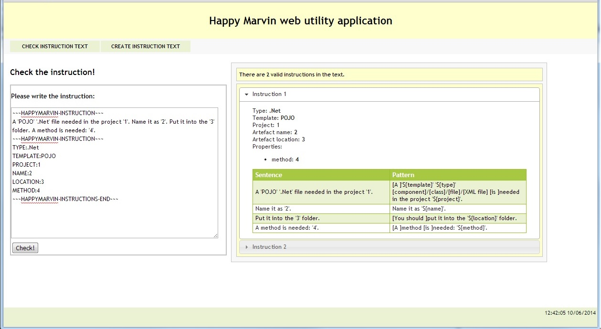

All you have to do is just to copy the instruction(s) to the textarea and clink the 'Check!' button.

Don't be afraid if you made some mistake you will get an error message. :)

If there are more instructions in the textarea on the left then all the instructions will be analyzed and displayed. On the picture above you can see there are two instructions in the textarea so both of them can be seen by clicking on the 'Instruction 1' or 'Instruction 2' header.

In case of error you can expect error message like
`InvalidInstructionException : There is not matching pattern for the sentence 'A 'POJO' '.Net' file needeed in the project '1'.'! Perhaps the problem is that first you have to define the general (TYPE,TEMPLATE,PROJECT,NAME,LOCATION) values in the sentences or in the key-values pairs...`