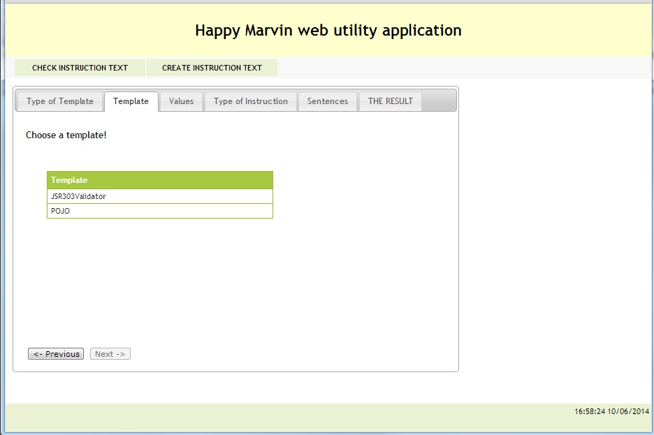

When you have to create an instruction there are 4+1 steps must be done:
  1. choosing a type
  1. choosing a template
  1. defining the values of the properties
  1. choosing the type of the instruction (key-value or sentence)
  1. in case of sentence type choosing the sentences

As these steps are connected to each other so a wizard can be used to create the instruction.

The first step is choose a type. The 'Next' button is disabled until a row is selected. If you select a row the second tab will open automatically.

The first step is choose a template. The template list depend on the type so that's why the type has to be selected first. The 'Next' button is disabled until a row is selected. If you select a row the second tab will open automatically. You can jump back any time by clicking on the 'Previous' button.

The third step is define the values. The 'Next' button is disabled until all the mandatory values are set.

The fourth step is to define the type of the instruction (key-value, sentence). If you choose 'key-value' then the next step will be the last one where you can see the result. Otherwise you still have to choose the sentences being used in the instruction.

If you chosen 'sentences' at the fourth step then you have to define the used sentences. This step is a little bit tricky but this is how it works: there is an order how yo have to choose sentences. First you have to select one from those sentences where the property 'type' can be found. Next you can see the sentences where the property 'template' exist and so on. The order is type -> template -> project -> name -> location -> <template dependant properties>. The list of the not chosen properties can be seen underneath (The remaining properties: ...).

On the final step you can see the created instruction. Well, it is not true... Namely it is but partly. In case of the key-value instruction you will have a final result. However if you chose sentences on the 4th step then you will have the sentences but they will look like
`I['d] need a 'POJO' 'Java' [component]/[class]/[file]/[XML file] in the [project]/[folder] 'ACME'.`
You have to decide leave or remove the characters "'d", you should choose a word from "component" / "class" / "file" / "XML file" and so on. By clicking on the 'Check the result' button the check page will open in an other tab and the instruction will be put into the textarea.

