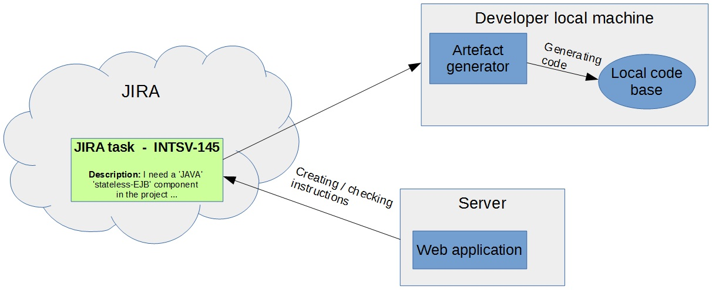

## Happy Marvin JIRA artefact generator ##

Well, I think the first question that occurs is WHY the name is Happy Marvin?? (Ok, maybe I am more interested in the meaningless things so it would be my first question. :) )
And of course I borrowed the idea from The Hitchhiker's Guide to the Galaxy book. My software is a robot-like stuff and why can't Marvin the sad robot be happy at one time?! :)

The second question is what is this program? What can be achieved with its help?
Let's have a look at the following picture!

A short answer is you can generate artefacts (Java code, .Net code, XML files, configuration files, ...) directly from the description of a JIRA issue. Naturally it is not a Skynet so it cannot think and process the sentences written in the JIRA description. However you don't have to reject to use normal sentences when you write the instructions for the artefact generators. The key is that the sentences must fit some rules that you can define. Basically patterns have to be set for the generator and with these patterns some valueable information can be mined from the description.
Let's see an example: you want the generator to create a stateless session bean Java class in one of your project in a package. You'd want to write a sentence like this:
> `I need a 'stateless session bean' 'Java' class in the project 'ACME' in the folder 'src/main/java/com/acme/business'.`
The bad thing is that you have to remember the sentence very precisely. So you can't write something like
> `I'd need a 'stateless session bean' 'Java' ccomponent in 'ACME' in the package 'src/main/java/com/acme/business'.`
and you absolutely can't use like
> `Create a 'stateless session bean' 'Java' class in the project 'ACME'. Please put the file into the 'src/main/java/com/acme/business' folder.`
(OK, perhaps you don't want to write these kind of sentences as maybe they aren't correct grammatically... :) )

The good news is that you can if you define patterns. With patterns the generator can accept more kind of sentences and still the valuable information can be taken out. The values in the example above are: **type** (Java), **template** (stateless session bean), **project** (ACME), **location** (src/main/java/com/acme/business). There is a fifth mandatory value: **name** (which is the name of the created artefact/file).
A pattern can be as follows:
> `I['d] need a '${template}' '${type}' [component]/[class]/[file]/[XML file] in the [project]/[folder] '${project}'.`
The characters between the square brackets are optional. It means that you can use the sentence
> `I'd need a ...`
or
> `I need a ...`
in the JIRA description. The "`[component]/[class]/[file]/[XML file]`" characters mean a choice, you have to use one of the words 'component', 'class', 'file' or 'XML file'. With the sample pattern above you can cover 2\*4\*2=16 permutations! And even you can define a very similar pattern again, the program will pick that pattern that suits.
> `I['d] need a '${template}' '${type}' [component]/[class]/[file]/[XML file] in the [project]/[folder] '${project}'.`
> `[A ]'${template}' '${type}' [class]/[file] is needed in the [project]/[folder] '${project}'.`

It is possible to define the instruction for the generator with simpe key-value pairs.

> `TYPE: Java` 
> `TEMPLATE: POJO` 
> `PROJECT: acme-factory` 
> `...`

A web application is provided to either check the created instruction or create one.
More information: [Using the Web Application](UsingWebApplication.md)

Downloads: [Downloads](Downloads.md)

## Help content ##
[Content](SideBarContent.md)

Any question: ric.flair.wcw@gmail.com